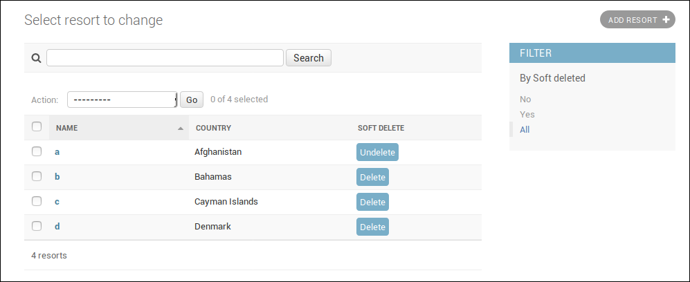

django-tombstones
=================

Unintrusive soft-delete for django.

An example admin screen for a soft-deletable model:

Design decisions
----------------

1) **Only works for models that have a primary key of type UUID**

2) Does not change the behaviour of `Model.delete`. Instead adds `soft_delete` and `soft_undelete` methods to model instances.

3) Does not care about cascading. If you soft-delete an object that has related objects, those related objects are untouched.

4) The soft-deletion state of a model is stored in a generic tombstones table, so each model is not cluttered with any extra `deleted` attribute.
This means:
    * Making a model soft-deletable does not require database changes to that model's table.
    * When using django-rest-framework model serializers, there is no need to worry about some `deleted` attribute appearing.
    * When querying soft-deletable models, an extra join to the tombstone table is made.

Requirements
------------

* Python: 3.4 and over
* Django: 1.8 or 1.10 and over

Usage
-----

Add tombstones to your `INSTALLED_APPS`, together with the contenttypes app  that comes with django
(it's most likely already an installed app):

    INSTALLED_APPS = (
    ...
    'django.contrib.contenttypes',
    'tombstones.apps.TombstoneConfig',
    )

For every model where you want soft-delete, you should inherit from SoftDeleteModel:

    class MyModel(SoftDeleteModel):
        ...

You should also use the soft-delete-aware ModelAdmin, and configure it:

    @admin.register(MyModel)
    class MyModelAdmin(SoftDeleteModelAdmin):
        list_filter = [SoftDeletedListFilter]             # Hides soft-deleted objects by default, and gives the option to show all objects.
        list_display = [..., 'soft_delete_button']        # Adds a column on the admin list with a button to delete/undelete the object
        readonly_fields = [..., 'soft_delete_button']     # Adds a button on the detail list to delete/undelete the object
        ...

References
----------
- https://github.com/scoursen/django-softdelete was an inspiration

